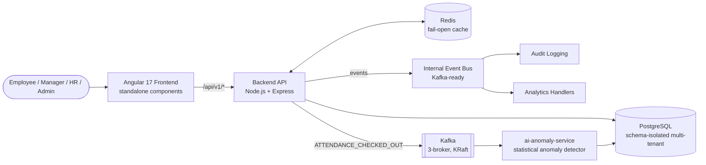
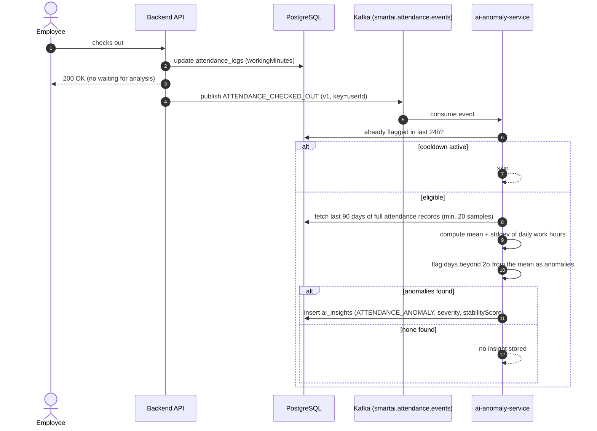

# SmartWorkforce AI

Workforce management platform for attendance, leave, and WFH tracking, with analytics computed from real attendance/leave data rather than mocked numbers. Multi-tenant, role-based (Employee / Manager / HR / Admin), event-driven.


## Getting Started

### Prerequisites
- Node.js 18+
- PostgreSQL 13+
- Angular CLI 17+

### Backend
```bash
cd backend
npm install
cp .env.example .env
# Edit .env: DATABASE_URL, DB_SCHEMA, JWT_SECRET, JWT_EXPIRES_IN
npm run db:init
npm run dev
```

### Frontend
```bash
cd frontend
npm install
ng serve
```

Frontend: `http://localhost:4200` · Backend: `http://localhost:3000`

### Demo accounts (seeded by `npm run db:init`)
| Role | Email | Password |
|---|---|---|
| Admin | admin@smartworkforce.ai | admin123 |
| HR | hr@smartworkforce.ai | hr123456 |
| Manager | manager@smartworkforce.ai | manager123 |
| Employee | john@smartworkforce.ai | emp123 |

## Architecture



**Key design decisions**

- **Multi-tenancy** — all tables scoped by `organization_id`; the app's own tables additionally live in a dedicated `smartai` Postgres schema (set via `DB_SCHEMA`) rather than assuming ownership of the whole database, since the shared server also hosts an unrelated schema for another system.
- **Event-driven** — actions (check-in, leave approval, WFH approval, announcements) publish to an internal event bus consumed by audit-logging and analytics handlers. Structured to swap in Kafka without changing call sites — see `backend/src/events/kafka.js` and the [`k8s/`](k8s/) manifests for the Kafka/Kubernetes deployment.
- **Fail-open caching** — Redis (`backend/src/utils/cache.js`) is an optimization, never a dependency: every operation has a 200ms timeout and degrades to a cache-miss/no-op if Redis is slow, down, or unreachable, so the API never fails because of the cache.
- **Analytics** — dashboard/insight numbers are computed from real `attendance_logs`/`leave_requests` data. Where the frontend expects a metric with no real backing data source (e.g. a task-completion rate — there's no task system), the API returns `0`/marked as untracked instead of fabricating a number.
- **Audit logging** — every mutating action is recorded with actor, entity, timestamp, and severity, feeding the same event bus.

## How the AI Works

`ai-anomaly-service` is a standalone consumer, independent from the main backend, that flags irregular work-hours patterns per employee. It's a **statistical** model today (mean/standard-deviation thresholding), not an LLM — see [Roadmap](#roadmap) for the planned ML-based upgrade.



Severity is derived from a `stabilityScore` (0-100, lower = more irregular): `< 40` → `HIGH`, `< 70` → `MEDIUM`, else `LOW`. The 24-hour cooldown and 20-sample minimum both exist to avoid flooding `ai_insights` with noisy, low-confidence results for employees with little attendance history yet.

## Tech Stack

| Layer | Technology |
|---|---|
| **Frontend** | Angular 17 (standalone components), Angular Material, Tailwind CSS |
| **Backend** | Node.js, Express, Sequelize (PostgreSQL ORM) |
| **Database** | PostgreSQL, schema-isolated multi-tenancy |
| **Cache** | Redis (fail-open — see Architecture) |
| **Messaging** | Apache Kafka (KRaft, no ZooKeeper, 3-broker) via `kafkajs` |
| **AI / Analytics** | Statistical anomaly detection (mean/σ work-hours model); dashboards backed by real attendance/leave data |
| **Auth** | JWT, bcrypt, RFC 6238 TOTP (2FA) |
| **Testing** | Jest |
| **Containers** | Docker, Docker Compose |
| **Orchestration** | Kubernetes (minikube), Kustomize, Helm |
| **CI/CD** | Jenkins (declarative pipeline) |

## API Reference

Full endpoint list per area lives in the route files under `backend/src/routes/v1/`. While the backend is running, `GET /api/v1/docs` returns a live, machine-generated summary of mounted routes.

| Area | Routes |
|---|---|
| Auth | `backend/src/routes/v1/auth.js` |
| Users / Team / Profile | `backend/src/routes/v1/users.js` |
| Attendance | `backend/src/routes/v1/attendance.js` |
| Leave | `backend/src/routes/v1/leave.js` |
| Analytics | `backend/src/routes/v1/analytics.js` |
| WFH | `backend/src/routes/v1/wfh.js` |
| Notifications | `backend/src/routes/v1/notifications.js` |
| Announcements | `backend/src/routes/v1/announcements.js` |

## Project Structure

```
smartworkforce-ai/
├── backend/
│   └── src/
│       ├── database/       # Sequelize config, migrations, seed data
│       ├── models/         # Organization, User, AttendanceLog, LeaveRequest, ...
│       ├── services/       # Business logic per domain
│       ├── routes/v1/      # Versioned REST routes
│       ├── middleware/     # Auth, validation, request metrics
│       ├── events/         # Event bus, Kafka producer, handlers
│       └── app.js          # Express entry point
├── frontend/
│   └── src/app/
│       ├── core/            # Guards, interceptors, shared services
│       └── features/        # Dashboard, attendance, leave, analytics, team, ...
├── ai-anomaly-service/       # Standalone Kafka-consuming anomaly-detection service
├── k8s/                      # Kubernetes manifests (Deployments, Kustomize, Helm chart, monitoring)
├── database/schema.sql
└── docker-compose.yml
```

## Database

11 tables (`organizations`, `users`, `shifts`, `attendance_logs`, `leave_requests`, `ai_insights`, `audit_logs`, `wfh_requests`, `notifications`, `announcements`, `certifications`), time-series-indexed on `(user_id, date)` for attendance, `(status, created_at)` for leave. See `database/schema.sql` for the full definition.

## Roadmap

- Kafka as the real event bus (event contracts and producer already in place, see `backend/src/events/kafka.js`; consumer-side anomaly service already exists in `ai-anomaly-service/`)
- Kubernetes deployment hardening (in progress — see `k8s/`)
- ML-based anomaly detection, replacing the current statistical approach
- Redis caching layer for hot read paths

## License

MIT
